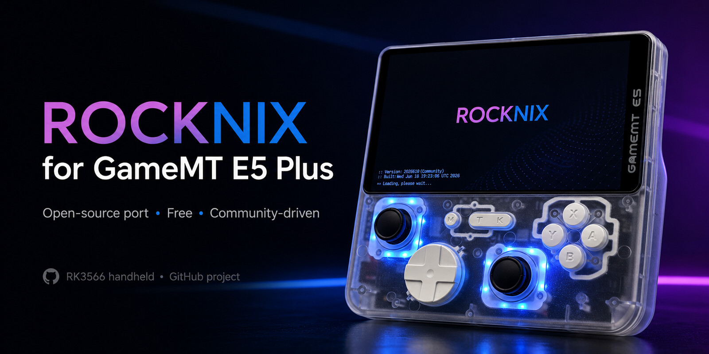
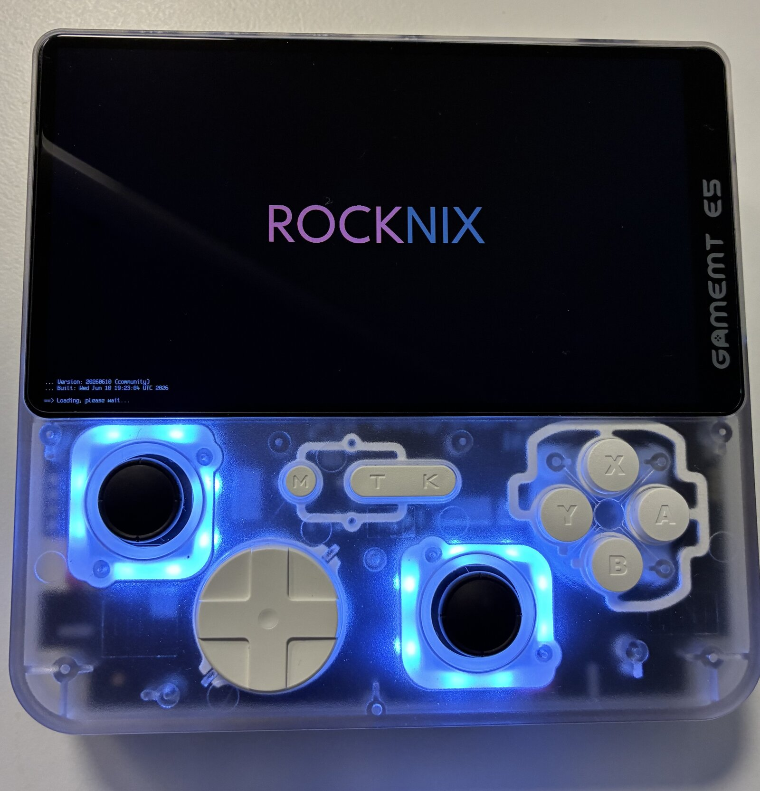
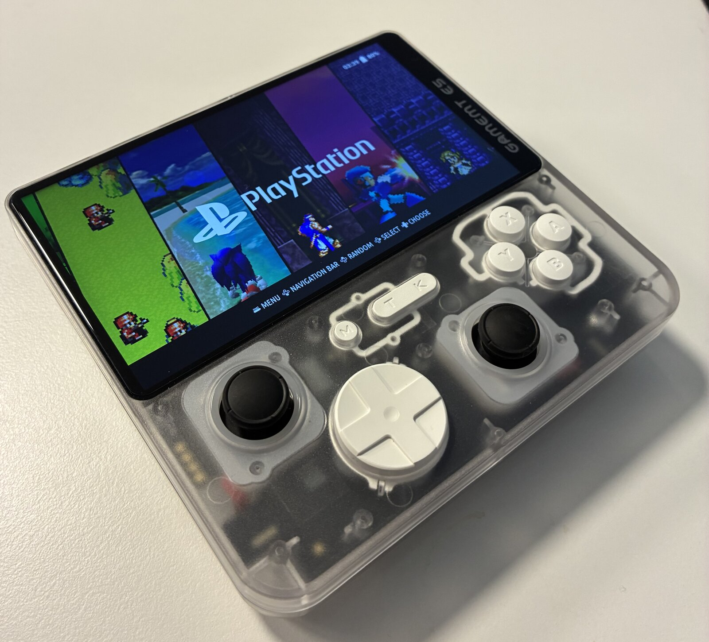

<div align="center">



**Turn the GameMT E5 Plus handheld into a real Linux retro-gaming console.**

[](https://github.com/yibudak/rocknix-e5p/actions/workflows/ci.yml) [](https://www.gnu.org/licenses/old-licenses/gpl-2.0.en.html) [](https://github.com/ROCKNIX/distribution) [](https://www.rock-chips.com/uploads/pdf/2022.8.26/191/RK3566%20Brief%20Datasheet.pdf)

[🕹️ What Works](#️-what-works) · [📸 Gallery](#-gallery) · [💾 Install](#-install) · [🔨 Build](#-build-it-yourself) · [📚 Docs](#-documentation)

</div>

---

## 🧐 What is this?

The **GameMT E5 Plus** is a budget retro handheld (Rockchip RK3566, 5" screen)
that ships with Android. Android is a clunky way to play retro games - so this
project ports [**ROCKNIX**](https://github.com/ROCKNIX/distribution), the
open-source Linux gaming distribution, to it.

You get EmulationStation, RetroArch and dozens of emulators booting straight
from a microSD card. **The internal storage is never touched** - pull the SD
card out and the device is back on stock Android, like nothing happened.

This is the **first working Linux port** for this device: earlier community
attempts failed on a wrong CPU-regulator definition that this port fixes,
along with a custom display driver written from scratch. The technical story
lives in [docs/PORTING.md](docs/PORTING.md).

---

## 🕹️ What Works

Everything below is verified **on real hardware**, not assumed:

| | Feature | Status | Notes |
|:---:|:---|:---:|:---|
| 📺 | Display (5" 720×1280, 60 Hz) | ✅ Works | Custom panel driver, correct colors & orientation |
| 🎮 | Buttons, D-pad, analog sticks | ✅ Works | Full mapping in EmulationStation & emulators |
| 🔊 | Speakers & headphone jack | ✅ Works | Auto jack detection, volume tuned to stock levels |
| 📶 | WiFi (2.4 + 5 GHz) | ✅ Works | Both bands verified; including mixed WPA2/WPA3 home networks |
| 🎧 | Bluetooth | ✅ Works | Pairing and BLE scan verified |
| 🔋 | Battery % & charging | ✅ Works | Calibration data taken from stock firmware |
| 💡 | LEDs | ✅ Works | On/off control from the settings menu |
| 😴 | Sleep / wake | ✅ Works | Deep suspend |
| ⚡ | CPU boost to 1.99 GHz | ✅ Works | Vendor-binned top speed, toggle in settings |
| 🖥️ | Mini-HDMI output | 🧪 Not tested yet | |
| 🎯 | Emulator deep-testing | 🧪 In progress | PSP, PS1, Dreamcast, N64, SNES, GBA test library |
| 📳 | Rumble | ❌ No hardware | The board has no vibration motor - not a software issue |

---

## 📸 Gallery

<div align="center">
<table>
  <tr>
    <td align="center">
      <br>
      <sub>Boot splash - joystick LEDs shining through the shell</sub>
    </td>
    <td align="center">
      <br>
      <sub>EmulationStation, ready to play</sub>
    </td>
  </tr>
</table>
</div>

---

## 💾 Install

> 📦 **No prebuilt image is published yet.** The first release is planned once
> emulator testing finishes. Until then you can
> [build the image yourself](#-build-it-yourself).

You need: a **microSD card** (16 GB+, A1-class recommended) and the built
`.img.gz` image.

**1. Flash the image to the SD card** (macOS/Linux example):

```bash
gunzip -c ROCKNIX-RK3566.aarch64-*-Generic.img.gz | sudo dd of=/dev/rdiskX bs=1m status=progress
```

**2. Point the bootloader at the right device tree.** Open the SD card's first
(FAT) partition and edit `extlinux/extlinux.conf` - replace the `FDTDIR` line:

```text
FDT /device_trees/rk3566-e5p.dtb
```

This step is required: the E5 Plus isn't in U-Boot's board list, so the DTB
must be set by hand.

**3. Insert the SD card and power on.** ROCKNIX boots into EmulationStation.
Connect to WiFi, enable SSH if you like, drop your ROMs into `/storage/roms`.

Detailed walkthrough with troubleshooting: [docs/FLASHING.md](docs/FLASHING.md)

> 🛟 **Can't brick it:** everything runs from the SD card. Remove the card →
> stock Android boots again.

---

## 🔨 Build It Yourself

The full image builds inside ROCKNIX's Docker container. Short version:

```bash
# inject the E5P kernel driver + device tree into the ROCKNIX tree
python3 scripts/integrate_postpatch.py

# build the full image (takes a few hours)
PROJECT=Rockchip DEVICE=RK3566 ARCH=aarch64 ./scripts/build_distro
```

Full guide - container setup, kernel-only rebuilds, known build gotchas:
[docs/BUILD.md](docs/BUILD.md)

---

## 📚 Documentation

Every subsystem has its own write-up, including how it was debugged - useful
if you're porting Linux to a similar RK3566 device:

| Doc | What's inside |
|:---|:---|
| [PORTING.md](docs/PORTING.md) | How the port works, key fixes, rebase checklist |
| [BUILD.md](docs/BUILD.md) | Building the image from source |
| [FLASHING.md](docs/FLASHING.md) | SD-card flashing & first boot |
| [DISPLAY.md](docs/DISPLAY.md) | Panel bring-up & the line-shift/color-rotation hunt |
| [WIFI.md](docs/WIFI.md) | RTL8733BS driver, Linux 6.12 fixes, WPA3 workaround |
| [BLUETOOTH.md](docs/BLUETOOTH.md) | BT bring-up, firmware extraction, reboot-wedge fix |
| [AUDIO.md](docs/AUDIO.md) | Speaker wiring quirk & volume tuning |
| [BATTERY.md](docs/BATTERY.md) | Fuel-gauge calibration from stock firmware |
| [LEDS.md](docs/LEDS.md) | LED control via the ROCKNIX quirk system |
| [VIBRATION.md](docs/VIBRATION.md) | Why there is no rumble (no motor on the board) |

---

## 🤝 Contributing

Testing on real hardware is the most valuable contribution - flash, play,
report. Bug reports, documentation fixes and PRs are all welcome.
See [CONTRIBUTING.md](CONTRIBUTING.md).

---

## 📜 License

- `kernel/panel-e5p.c` - **GPL-2.0**
- `dts/rk3566-e5p.dts` - **GPL-2.0+ OR MIT**
- Scripts & docs - **GPL-2.0** or **MIT** where noted

See [LICENSE](LICENSE) for the full text.

> ⚠️ **Firmware notice:** `firmware/rtl_bt/rtl8733bs_fw.bin` and
> `rtl8733bs_config.bin` are proprietary Realtek firmware blobs, extracted
> from the device's stock Android vendor partition. They are **not** covered
> by this repository's license; copyright belongs to Realtek Semiconductor
> Corp. They are redistributed here solely to make the device functional, in
> the same spirit as the `linux-firmware` tree. If you are a rights holder
> and object to this distribution, please open an issue.

---

## 🙏 Acknowledgements

- [**ROCKNIX**](https://github.com/ROCKNIX/distribution) team for the excellent immutable gaming distro
- **Powkiddy X55** device tree authors for the RK3566 base
- **Mainline Linux** `panel-himax-hx8394.c` authors for the driver structure

---

<div align="center">

Maintained by [**@yibudak**](https://github.com/yibudak)

⭐ **Star this repo if it helped you!** ⭐

</div>

---

## ⚠️ Disclaimer

This is an **unofficial community port**, not affiliated with GameMT or
ROCKNIX. Use at your own risk. Keep the stock eMMC untouched and boot from
**SD card only** - that's what makes the whole thing risk-free.
